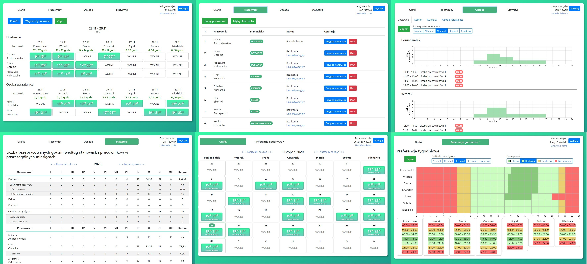

# Engineer's Thesis
[](https://circleci.com/gh/werekkk/engineers-thesis)

[Polski](./README.md)



## Introduction
This repository contains the source code of the system that was the topic of my engineer's thesis. The system is a web application created with Angular and Spring Boot (with the PostgreSQL database). The system has been deployed onto an external www serwer and is available from the website [jwer.pl/praca-inzynierska](http://www.jwer.pl/praca-inzynierska)

The system allows:
* Creating employer's account - the person managing the workplace
* Managing the employee's list by the employer
* Creating the employee's account using the activation link generated by the employer
* Managing the list of positions in the workplace by the employer
* Assigning employees' positions by the employer
* Creating work schedules manually - assigning employees' shifts on specific positions in given time periods  
* Browsing the workplace work schedule by the employer
* Browsing employee's own work schedule by the employee
* Defining employee's hour preferences by the employee - time periods in which the employee can (willingly or not) or cannot appear at the workplace
* Defining the position's staff by the employer - required number of employee's present at work at a specific position in a given time period 
* Generating work schedules automatically by the employer based on the employees' hour preferences and positions' staff requirements
* Browsing working time statistics by the employer calculated based on the work schedule data

## Running
Before building and running the system one has to install the following tools:
* Java (version 8 and higher)
* npm
* PostgreSQL (with the possibility of running commands from command line - to check if the command line commands are enabled run: ```psql --version```)

To run the system, the following steps need to be performed:
1. Cloning the repository:

    ```git clone https://github.com/werekkk/engineers-thesis.git```
    
2. Creating the right PostgreSQL database:

    ```psql --username=<POSTGRESQL USERNAME> -c "create database <DATABASE NAME>;"```
    
    For example:
    
    ```psql --username=postgres -c "create database praca_inzynierska_wernikowski;"```
    
    Make sure that the PostgreSQL user is authorized to create the database. When running the above command PostgreSQL might ask for the user password. 
    
3. Setting the database parameters:

    In the file ```engineers-thesis\praca-inzynierska-backend\application\src\main\resources\application.properties``` one has to set the correct parameters defining the URL address, username and password required to use PostgreSQL - respectively the 2nd, 3rd and 4th line of the file.
    
4. Testing and building the application:

    Entering the cloned repository directory:

    ``` cd engineers-thesis```

    Running the Maven tasks:

    ```mvnw clean install```

    The system is built as a single praca-inzynierska.war file in the /praca-inzynierska-backend/application/target/ directory
  
5. Running the system:
  
    The system can be ran in three ways:

     1. By deploying the praca-inzynierska.war file into the web app container (e.g. Tomcat).
     2. By running the app from the IDE (the main function inside the jwer.backend.BackendApplikation.kt file) - one has to remember beforehand to set the right parameters (database URL, PostgreSQL username and password) in the application.properties file in the application module.
     3. From the command line:
     ```mvnw spring-boot:run -pl jwer:engineers-thesis-application```
    
    After following method 2 or 3, the app is available at the url [localhost:8080](http://localhost:8080/index.html)
    
    When running the app for the first time a demo employer's account is created (username: test, password: test) with sample employees' and positions' data.
  

## Tests

Created tests cover (among others) the functionalities of the employer's employees' view (```/employer/employees```). The view allows creating and removing employees and positions as well as assigning positions to a specific employee.

Frontend tests are located in:  
  
* [employees-list.component.spec.ts](praca-inzynierska-frontend/src/app/app/components/employer/employees-list/employees-list.component.spec.ts) - the employee list component
* [employees-edit-employee-positions-modal.component.spec.ts](praca-inzynierska-frontend/src/app/app/components/employer/employees-edit-employee-positions-modal/employees-edit-employee-positions-modal.component.spec.ts) - a dialog for assigning positions to an employee
* [employees-edit-global-positions-modal.component.spec.ts](praca-inzynierska-frontend/src/app/app/components/employer/employees-edit-global-positions-modal/employees-edit-global-positions-modal.component.spec.ts) - a dialog for editing the workplace's position list 
* [employees-new-employee-modal.component.spec.ts](praca-inzynierska-frontend/src/app/app/components/employer/employees-new-employee-modal/employees-new-employee-modal.component.spec.ts) - a dialog for adding a new employee

Backend tests are ran on a temporary H2 database instance. The tests are located at:

* [EmployeeServiceTests.kt](praca-inzynierska-backend/application/src/test/kotlin/jwer/backend/EmployeeServiceTests.kt) - where the controller's methods for getting, adding and removing employees are tested
* [PositionServiceTests.kt](praca-inzynierska-backend/application/src/test/kotlin/jwer/backend/PositionServiceTests.kt) - where the controller's methods for getting, adding, removing and assigning positions are tested

## Project structure

The project is divided into a frontend (Angular) and a backend (Spring Boot - Kotlin) part. 

The components of the frontend application were divided into four modules:

* [main](praca-inzynierska-frontend/src/app/app/components/main) - containing views for not logged in users
* [employer](praca-inzynierska-frontend/src/app/app/components/employer) - containing views for users with the employer role
* [employee](praca-inzynierska-frontend/src/app/app/components/employee) - containing views for users with the employee role
* [shared](praca-inzynierska-frontend/src/app/app/components/shared) - containing components used in more than one module

The logic of the backend application was divided into two modules:

* [application](praca-inzynierska-backend/application) - responsible for answering frontend requests, handling the business logic and contacting with the database
* [schedule-generator](praca-inzynierska-backend/schedule-generator) - allows generating work schedules automatically based on the given configuration using the simulated annealing metaheuristic

_Jacek Wernikowski_
